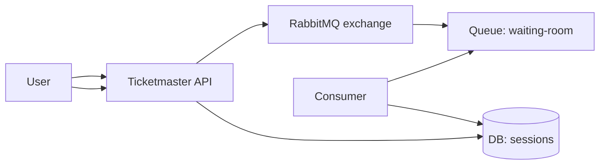
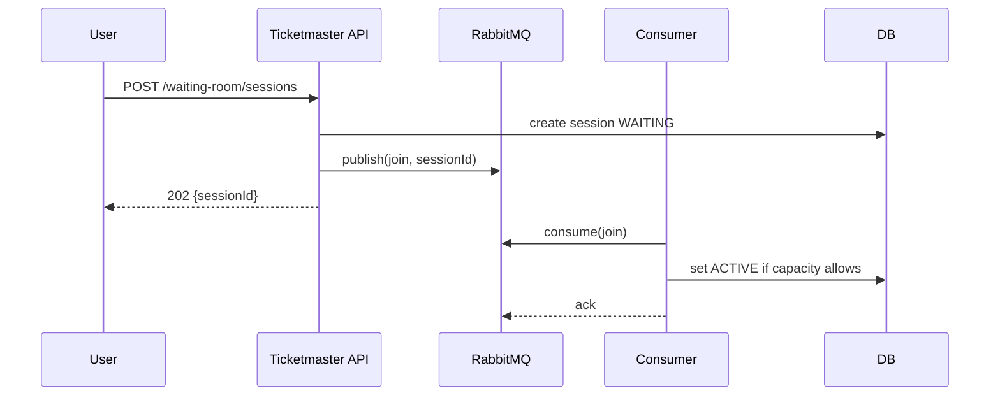

# Waiting room with RabbitMQ

RabbitMQ implements a waiting room as a classic work-queue: join requests are messages; consumers grant permits.

## Tech choices
- Spring Boot 3.5.9 (Spring MVC), Java 21
- RabbitMQ (Testcontainers for local testing)

## API sketch

- `POST /api/waiting-room/sessions` → `{waitingRoomSessionId}`
- `GET /api/waiting-room/sessions/{id}` → `{status}`

## Diagrams

## Trade-offs
- Pros: strong work-queue semantics; flexible routing.
- Cons: operating a broker; limited replay compared to Kafka; at-least-once delivery → need idempotent consumers.
