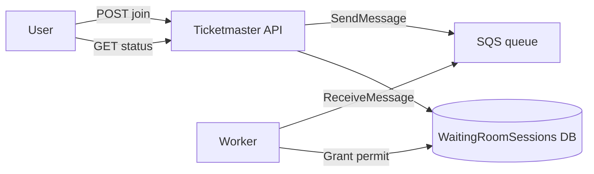
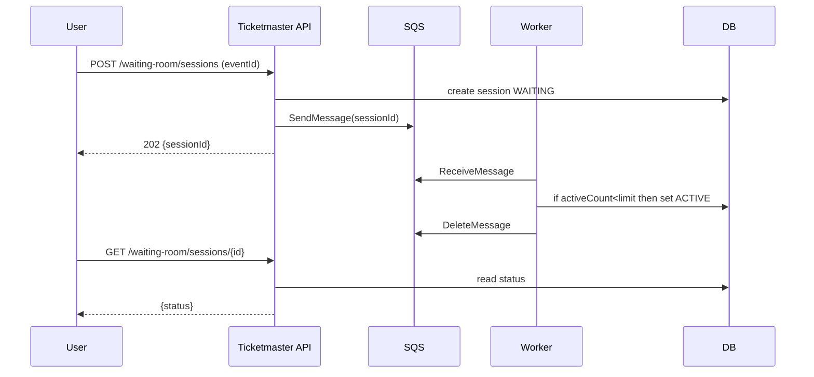

# Waiting room with SQS

SQS can implement a waiting room by buffering “join requests” and letting a small number of consumers grant **active selection permits**.

## Tech choices
- Spring Boot 3.5.9 (Spring MVC), Java 21
- AWS SQS (or LocalStack for local testing)

## Core idea

1) User joins waiting room → server enqueues a message `{sessionId, userId, eventId}`.
2) A consumer processes messages and activates sessions up to a configured concurrency.
3) User polls / receives notification when status becomes `ACTIVE`.

## API sketch

- `POST /api/waiting-room/sessions` `{eventId}` → `{waitingRoomSessionId}`
- `GET /api/waiting-room/sessions/{id}` → `{status, positionHint?, expiresAt}`

## Diagrams

## Trade-offs
- Pros: easy mental model, managed in AWS.
- Cons: limited replay semantics; ordering depends on using FIFO queues; extra moving parts (worker + persistence).

## Testing (later)
- Use LocalStack + Testcontainers to validate enqueue/consume flow.
- Curl smoke tests (once implemented):
  - `curl -XPOST localhost:8080/api/waiting-room/sessions -H "content-type: application/json" -d '{"eventId":"E1"}'`
  - `curl localhost:8080/api/waiting-room/sessions/<id>`
