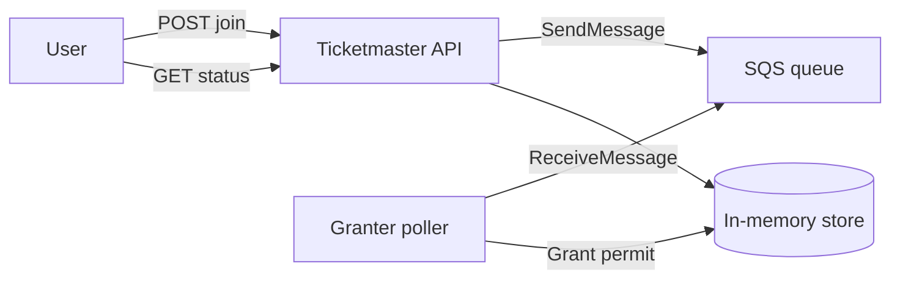
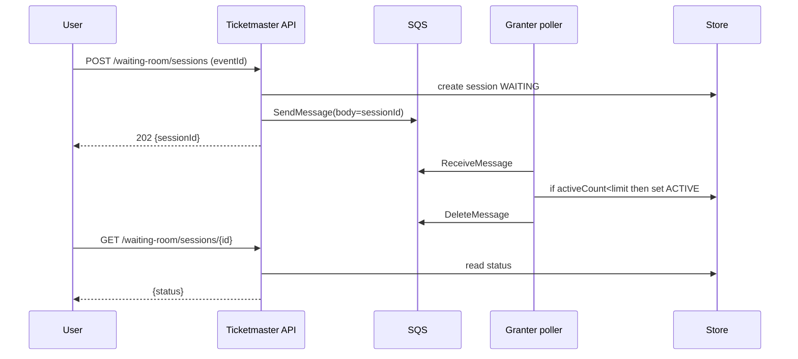

# Waiting room with SQS

SQS can implement a waiting room by buffering “join requests” and letting a small number of consumers grant **active selection permits**.

## Tech choices
- Spring Boot 3.5.9 (Spring MVC), Java 21
- AWS SQS via AWS SDK v2 (or LocalStack for local testing)

## Core idea

1) User joins waiting room → server creates a `WAITING` session and enqueues a message with body = `sessionId`.
2) A scheduled poller receives messages and activates sessions up to a configured capacity.
3) User polls status until it becomes `ACTIVE`.

## API sketch

- `POST /api/waiting-room/sessions` `{eventId, userId}` → `202 {sessionId}`
- `GET /api/waiting-room/sessions/{id}` → `200 WaitingRoomSession`
- `POST /api/waiting-room/sessions/{id}:heartbeat` → `204`
- `POST /api/waiting-room/sessions/{id}:leave` → `204`

## Diagrams





## Trade-offs
- Pros: easy mental model, managed in AWS.
- Cons: limited replay semantics; ordering depends on using FIFO queues; extra moving parts (worker + persistence).

## Running

Local SQS is easiest via LocalStack.

1) Start LocalStack SQS (Docker):

```bash
docker run --rm -p 4566:4566 localstack/localstack:latest
```

2) Run the app (config in `src/main/resources/application.yml`):

```bash
./run.sh
```

## Testing

Integration test uses Testcontainers + LocalStack.

```bash
./test.sh
```

## Curl

```bash
curl -s -X POST "http://localhost:8080/api/waiting-room/sessions" \
  -H "content-type: application/json" \
  -d '{"eventId":"E1","userId":"U1"}'
```

Then poll:

```bash
curl -s "http://localhost:8080/api/waiting-room/sessions/<sessionId>"
```
