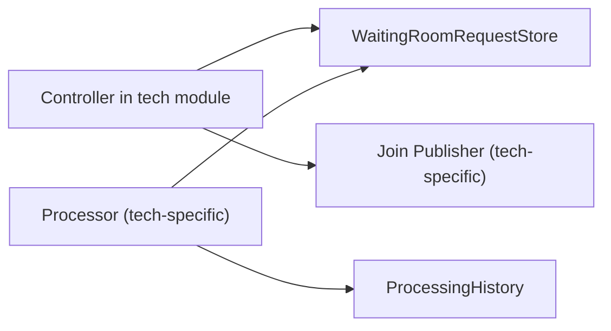

# waiting-room-core

Shared, non-technology-specific building blocks for the `tech-waiting-room/*` examples.

```mermaid
flowchart LR
  C[Controller in tech module] --> S[WaitingRoomRequestStore]
  C --> J["Join Publisher (tech-specific)"]
  P["Processor (tech-specific)"] --> S
  P --> H[ProcessingHistory]
```
