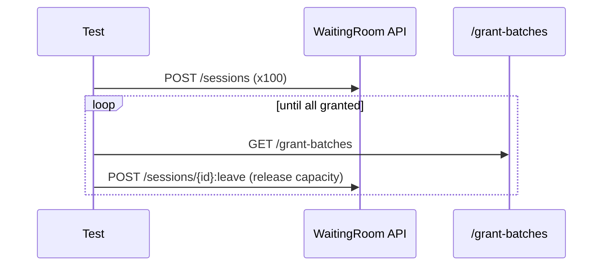

# waiting-room-test-support

Shared test helpers for the `tech-waiting-room/*` integration tests.

```mermaid
sequenceDiagram
  participant T as Test
  participant API as WaitingRoom API
  participant B as /grant-batches
  T->>API: POST /sessions (x100)
  loop until all granted
    T->>B: GET /grant-batches
    T->>API: POST /sessions/{id}:leave (release capacity)
  end
```
